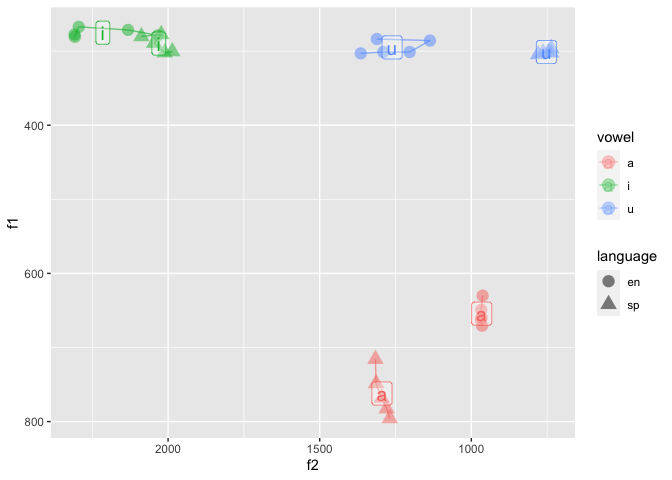

README
================

**7a.**

The main idea of this party of the script is to help getting the
Spectral Centroids and Trajectory Length. By using this portion of the
script we are trying to get the five equidistant locations(20%, 35%,
50%, 65%, 80%) of the vowel(durationV).

**7b.**

The script loads the WAV file we recorded, and using a loop to get item
and vowel labels using the textgrid we created. Then, still in the loop,
according to the interval tiers we created, the scripts gets formants at
the time landmarks of 20% 35% 50% 65% and 80% of each vowel, also it
calculates the spectral centroids and trajectory length using the
formants. Finally it saves results to a CSV file.

**7c.**

In pa\_2 we cut the one long recording to different short sound files
containing only one word, and in each short sound file we do the
segmentation and extract the data. In pa\_3 we don’t cut the one long
recording, and just use the interval tiers of the textgrid to “tell” the
loop what to do. The advantage of pa\_3 way of doing it is that we don’t
generate unwanted files, and it saves time. However, the short sound
files of single words may come handy for more analysis.

``` r
library(tidyverse)
```

    ## ── Attaching packages ─────────────────────────────────────── tidyverse 1.3.1 ──

    ## ✓ ggplot2 3.3.5     ✓ purrr   0.3.4
    ## ✓ tibble  3.1.6     ✓ dplyr   1.0.8
    ## ✓ tidyr   1.2.0     ✓ stringr 1.4.0
    ## ✓ readr   2.1.2     ✓ forcats 0.5.1

    ## Warning: package 'tidyr' was built under R version 4.0.5

    ## Warning: package 'dplyr' was built under R version 4.0.5

    ## ── Conflicts ────────────────────────────────────────── tidyverse_conflicts() ──
    ## x dplyr::filter() masks stats::filter()
    ## x dplyr::lag()    masks stats::lag()

``` r
library(tidyr)
library(dplyr)
library(here)
```

    ## here() starts at /Users/gabmac/Documents/RU/2022Spring/Phonology/pa_3_2022

``` r
vowel_data <- read_csv('./data/vowel_data.csv')
```

    ## Rows: 36 Columns: 17

    ## ── Column specification ────────────────────────────────────────────────────────
    ## Delimiter: ","
    ## chr  (4): id, item, vowel, language
    ## dbl (13): f1_cent, f2_cent, tl, f1_20, f1_35, f1_50, f1_65, f1_80, f2_20, f2...
    ## 
    ## ℹ Use `spec()` to retrieve the full column specification for this data.
    ## ℹ Specify the column types or set `show_col_types = FALSE` to quiet this message.

``` r
#calculate average F1/F2 centroids and trajectory length (include SD)
vowel_data %>% 
  summarize(f1_cent_avg = mean(f1_cent), sd_f1 = sd(f1_cent), f2_cent_avg = mean(f2_cent),sd_f2 = sd(f2_cent), tl_avg = mean(tl), sd_tl = sd(tl))
```

    ## # A tibble: 1 × 6
    ##   f1_cent_avg sd_f1 f2_cent_avg sd_f2 tl_avg sd_tl
    ##         <dbl> <dbl>       <dbl> <dbl>  <dbl> <dbl>
    ## 1        430.  203.       1420.  563.   296.  274.

``` r
#???1 Mean for everything or mean for each vowel-langugage combination?


#trajectory length as a function of vowel and language
vowel_data %>% 
  ggplot(., aes(x = vowel, y = tl, color = language)) + 
    geom_boxplot(alpha = 0.7)
```

<!-- -->

``` r
#???2 And I have a big question on "of vowel and language", so here are some solutions I propose
#F1 as a function of vowel and language
#solution 1
vowel_data %>% 
  ggplot(., aes(x = language, y = f1_cent, color = vowel)) + 
    geom_boxplot(alpha = 0.7)
```

<!-- -->

``` r
#solution 1.5
vowel_data %>% 
  ggplot(., aes(x = vowel, y = f1_cent, color = language)) + 
    geom_boxplot(alpha = 0.7)
```

<!-- -->

``` r
#solution 2
vowel_data %>% 
  unite(., col = vowel_language, vowel, language, sep = "_", remove = FALSE) %>% 
  ggplot(., aes(x = vowel_language, y = f1_cent)) + 
    geom_boxplot(alpha = 1)
```

<!-- -->

``` r
#solution 3
vowel_data %>%
  ggplot(aes(x = vowel, y = f1_cent)) +
  geom_boxplot() +
  facet_wrap(vars(language), ncol = 2) +
  labs(x = "vowels", y = "f1 centroid value")
```

<!-- -->

``` r
#F2 as a function of vowel and language
vowel_data %>% 
  ggplot(., aes(x = vowel, y = f2_cent, color = language)) + 
    geom_boxplot(alpha = 0.7)
```

<!-- -->

``` r
#???3 (Bonus) Plot trajectory length in F1/F2 vowel space (don't know how to draw the fancy point-line thingy )
#(Bonus) Plot spectral centroids in F1/F2 vowel space

vowel_data %>% 
  ggplot(., aes(x = f2_cent, y = f1_cent, color = vowel, shape = language)) + 
    geom_point(alpha = 0.8) + 
    #???4 geom_text(data = vowel_means, aes(label = vowel), size = 5) + (don't know how to get the mean for each group)
    scale_y_reverse() + 
    scale_x_reverse()
```

<!-- -->
